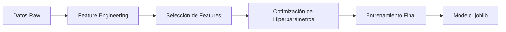

# Predicción de Calorías Quemadas Durante el Ejercicio

<p align="center">
  <a href="https://github.com/fertueros/azure_ml/releases"></a>
  
  
  
</p>

Este proyecto de Machine Learning Engineering tiene como objetivo desarrollar un modelo de regresión robusto y preciso para predecir la cantidad de calorías quemadas por un individuo durante una sesión de ejercicio, basándose en sus datos demográficos y métricas fisiológicas.

---

## 📝 1. Problema de Negocio y Objetivo de ML

**Contexto:** En el ámbito de la salud y el fitness, cuantificar el gasto energético es fundamental para la planificación de dietas y regímenes de entrenamiento. Una estimación precisa de las calorías quemadas ayuda a los usuarios a alcanzar sus objetivos de peso y condición física de manera más efectiva.

**Objetivo de Machine Learning:** El objetivo es construir un modelo supervisado de **regresión** que prediga la variable `Calories` con el menor error posible, medido principalmente por la **Raíz del Error Cuadrático Medio (RMSE)**. El modelo debe ser interpretable y basarse en características con sentido fisiológico.

---

## 🌊 2. Diagrama de Flujo del Proyecto

El proyecto sigue un ciclo de vida estructurado de Machine Learning, desde la exploración inicial de los datos hasta la evaluación del modelo final.



---

## 📊 3. Descripción del Dataset

El conjunto de datos proviene de la **competencia Kaggle Playground Series – Season 5, Episode 5** (*"Predict Calorie Expenditure"*). Contiene sesiones de ejercicio con datos demográficos básicos y biometría registrada por dispositivos *wearables*.

| Ítem                      | Detalle                                                                                                                                     |
| ------------------------- | ------------------------------------------------------------------------------------------------------------------------------------------- |
| **Fuente**                | [Página de la competición en Kaggle](https://kaggle.com/competitions/playground-series-s5e5)  Autores: Walter Reade & Elizabeth Park (2025) |
| **Licencia**              | CC BY‑4.0 – permite redistribución y obras derivadas con atribución                                                                         |
| **Filas utilizadas**      | 205 000 (muestra estratificada por género de las 750 000 filas originales, para reducir tiempo de cómputo manteniendo el balance)            |
| **Variable objetivo**     | `Calories` – kilocalorías quemadas durante la sesión                                                                                        |
| **Familias de variables** | **Demográficas:** `Gender`, `Age`, `Height`, `Weight`   **Métricas de la sesión:** `Duration`, `Heart_Rate`, `Body_Temp`                    |
| **Valores faltantes**     | Ninguno; corroborado en la etapa de EDA                                                                                                     |
| **Unidades**              | Altura en cm, Peso en kg, Temperatura en °C, Frecuencia cardíaca en bpm                                                                     |

> Los CSV originales se almacenan en `data/raw` y nunca se modifican. Todas las transformaciones se aplican en `data/interim/` para garantizar reproducibilidad.

### Diccionario de Datos

| Columna | Tipo de Dato | Descripción |
| :--- | :--- | :--- |
| `User_ID` | int64 | Identificador único para cada usuario. |
| `Gender` | bool | Sexo del usuario (0: Femenino, 1: Masculino). |
| `Age` | int64 | Edad del usuario en años. |
| `Height` | float64 | Altura del usuario en centímetros. |
| `Weight` | float64 | Peso del usuario en kilogramos. |
| `Duration` | float64 | Duración de la sesión de ejercicio en minutos. |
| `Heart_Rate` | float64 | Frecuencia cardíaca promedio durante la sesión (latidos por minuto). |
| `Body_Temp` | float64 | Temperatura corporal durante la sesión en grados Celsius. |
| **`Calories`** | **float64** | **(TARGET)** Calorías quemadas durante la sesión. |

---

## 🤖 4. Model Card: `CaloriesPredictor-LGBM-v1.0`

### Detalles del Modelo
- **Desarrollador:** [Fernando]
- **Fecha:** [22, Junio 2025]
- **Versión:** 1.0.0
- **Tipo de Modelo:** Regresión con Gradient Boosting (LightGBM - LGBMRegressor).

### Uso Previsto
- **Uso Primario:** Estimar el gasto calórico de una sesión de ejercicio para ser utilizado en aplicaciones de fitness y salud, ayudando a los usuarios en el seguimiento de sus metas.
- **Usuarios Previstos:** Desarrolladores de aplicaciones de fitness, nutricionistas, entrenadores personales.
- **Fuera de Alcance:** El modelo no debe ser utilizado para diagnósticos médicos ni para tomar decisiones críticas de salud sin la supervisión de un profesional.

### Evaluación
El modelo final se evaluó en un conjunto de prueba no visto (2.5% de los datos). El rendimiento fue consistente con los resultados de la validación cruzada, indicando una buena generalización.

| Métrica | Rendimiento en Prueba |
| :--- | :--- |
| **RMSE** | **3.407 Calorías** |
| **MAE** | 2.12 Calorías |
| **R²** | 0.997 |
| **Latencia por Predicción** | 0.182 ms |

### Datos de Entrenamiento
El modelo fue entrenado con el 97.5% del dataset (200,000 registros), utilizando un conjunto de 12 características de ingeniería y base, seleccionadas por su poder predictivo e interpretabilidad. La variable objetivo `Calories` fue transformada logarítmicamente (`log1p`) durante el entrenamiento para estabilizar la varianza.

---
## 🌿 5. Versioning y Estrategia de Git

### Control de Versiones
Este proyecto sigue los principios de **[Versionado Semántico 2.0.0](https://semver.org/lang/es/)**. Todos los lanzamientos y sus cambios están documentados en la **[sección de Releases](https://github.com/fertueros/azure_ml/releases)** de este repositorio.

### Estrategia de Ramas (GitHub Flow)
Se utiliza un flujo de trabajo basado en ramas para asegurar la estabilidad del código:
-   **`main`**: Contiene el código de producción, estable y listo para ser desplegado. Solo recibe merges desde `developer` para los releases.
-   **`developer`**: Es la rama principal de integración. Todo el nuevo código se fusiona aquí primero.
-   **`feature/*`**: Cada nueva funcionalidad o etapa (EDA, optimización, etc.) se desarrolla en su propia rama. Estas ramas se fusionan en `developer` a través de **Pull Requests** para su revisión.
-   **Ejemplo:** [Pull Request completado](https://github.com/fertueros/azure_ml/pull/2).

---

## 📈 6. Resultados y Conclusiones

### Resultados
El modelo final, un `LGBMRegressor` optimizado, alcanzó un **RMSE de 3.407** en datos no vistos. Este resultado es muy robusto y confirma que el modelo puede predecir la quema de calorías con un alto grado de precisión.

El análisis de importancia de características reveló que `feno_var` (una variable fenomenológica creada), el `Gender`, y características de interacción como `Duration_x_Heart_Rate` (volumen de trabajo cardíaco) son los predictores más influyentes.

### Conclusiones
El proyecto ha culminado con éxito en la creación de un modelo de Machine Learning preciso y fiable. El proceso iterativo, que incluyó la solución de un problema inicial de sobreajuste mediante el aumento de datos y la regularización, fue clave para alcanzar un modelo final generalizable.

El pipeline automatizado a través de `run.py` asegura la reproducibilidad y facilita la integración del modelo en sistemas de producción.

---

## 🚀 7. Guía de Reproducibilidad y Ejecución

Para una guía detallada sobre cómo configurar el entorno y replicar los resultados, consulta **[`docs/REPRODUCIBILIDAD.md`](docs/REPRODUCIBILIDAD.md)**.

Para ejecutar el pipeline principal desde la línea de comandos:

```bash
# Entrenar el modelo final
python run.py train

# Evaluar el modelo en el conjunto de prueba
python run.py evaluate

# Realizar una predicción en un nuevo archivo
python run.py predict /ruta/a/tus/datos.csv
```
### Explorar Experimentos con MLflow

Todos los experimentos de modelado y optimización de hiperparámetros se registran utilizando MLflow. Para explorar los resultados de forma interactiva:

1.  Abre una terminal en la **raíz del proyecto**.
2.  Ejecuta el siguiente comando para iniciar la interfaz de usuario de MLflow:

    ```bash
    mlflow ui --backend-store-uri ./mlruns
    ```
3.  Abre tu navegador y ve a **`http://localhost:5000`**.

*   **`--backend-store-uri ./mlruns`**: Este comando le dice explícitamente a MLflow que use la carpeta `mlruns` del directorio actual como la base de datos de experimentos. Esto evita problemas si ejecutas el comando desde otra ubicación.

---

## 📜 8. Project Organization

```
├── LICENSE            <- Open-source license if one is chosen
├── Makefile           <- Makefile with convenience commands like `make data` or `make train`
├── README.md          <- The top-level README for developers using this project.
├── data
│   ├── external       <- Data from third party sources.
│   ├── interim        <- Intermediate data that has been transformed.
│   ├── processed      <- The final, canonical data sets for modeling.
│   └── raw            <- The original, immutable data dump.
│
├── docs               <- A default mkdocs project; see www.mkdocs.org for details
│
├── models             <- Trained and serialized models, model predictions, or model summaries
│
├── notebooks          <- Jupyter notebooks. Naming convention is a number (for ordering),
│                         the creator's initials, and a short `-` delimited description, e.g.
│                         `1.0-jqp-initial-data-exploration`.
│
├── pyproject.toml     <- Project configuration file with package metadata for 
│                         package_ml and configuration for tools like black
│
├── references         <- Data dictionaries, manuals, and all other explanatory materials.
│
├── reports            <- Generated analysis as HTML, PDF, LaTeX, etc.
│   └── figures        <- Generated graphics and figures to be used in reporting
│
├── requirements.txt   <- The requirements file for reproducing the analysis environment, e.g.
│                         generated with `pip freeze > requirements.txt`
│
├── setup.cfg          <- Configuration file for flake8
│
└── package_ml   <- Source code for use in this project.
    │
    ├── __init__.py             <- Makes package_ml a Python module
    │
    ├── config.py               <- Store useful variables and configuration
    │
    ├── dataset.py              <- Scripts to download or generate data
    │
    ├── features.py             <- Code to create features for modeling
    │
    ├── modeling                
    │   ├── __init__.py 
    │   ├── predict.py          <- Code to run model inference with trained models          
    │   └── train.py            <- Code to train models
    │
    └── plots.py                <- Code to create visualizations
```

---

## 📚 9. Referencias Técnicas

Las decisiones clave de modelado en este proyecto se basan en herramientas y conceptos bien establecidos:
- **Transformación de Target:** Para manejar la distribución sesgada del target y mejorar el rendimiento de los modelos, se utilizó `TransformedTargetRegressor` de Scikit-learn. [Ver documentación](https://scikit-learn.org/stable/modules/generated/sklearn.compose.TransformedTargetRegressor.html).
- **Seguimiento de Experimentos:** La gestión y comparación de todos los experimentos de modelado se realizó con MLflow. [Ver documentación de MLflow](https://mlflow.org/docs/latest/index.html).

